# 📝 TaskList - Proyecto para ForIT


Es una aplicación fullstack para gestionar tareas. Podés crear, ver, editar y eliminar tareas usando una API en Express conectada a Supabase, y un frontend moderno hecho en React con diseño oscuro y Bootstrap.

---
## 🚀 Ejecutar el proyecto

### 1° ejecutar BackEnd

```bash
cd backEnd
npm install
cp .env.example .env
npm run app
```

La API correrá en: `http://localhost:3004/api/tasks`

### 2° ejecutar FrontEnd

```bash
cd frontEnd
npm install
cp .env.example .env
npm run dev
```

La app React se abrirá automáticamente en tu navegador en `http://localhost:5173`.

---
# Screenshots de la Aplicación Funcionando

## Componente TaskList.jsx 

Muestra la lista de tareas en http://localhost:5173/api/tasks

## Componente TaskForm.jsx

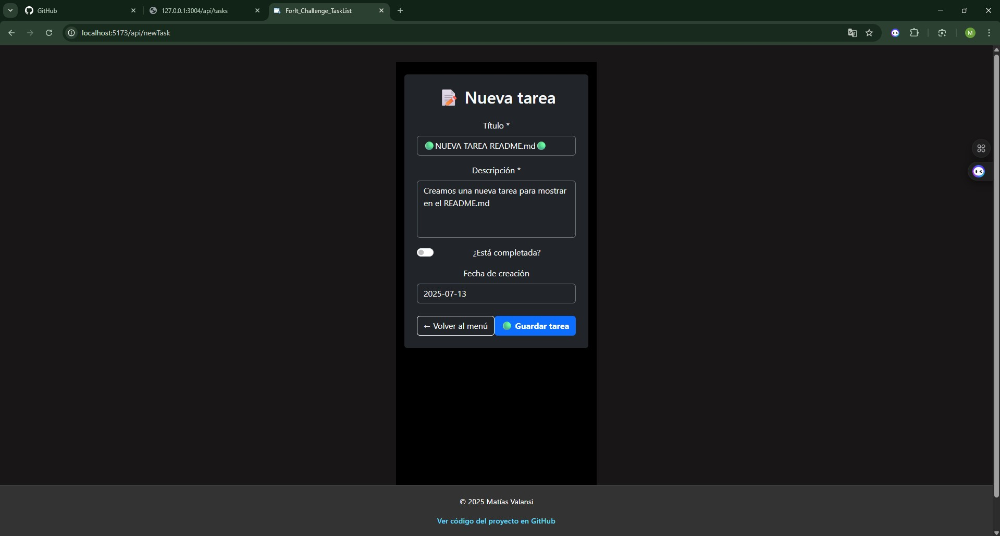
Creo una tarea en http://localhost:5173/api/newTask

## Regreso a la TaskList.jsx

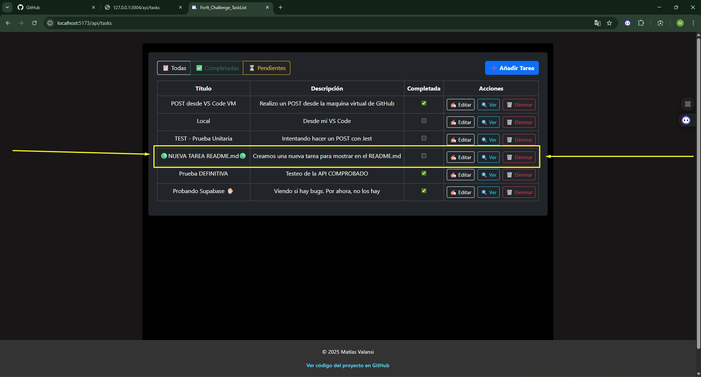
Se muestra la tarea creada

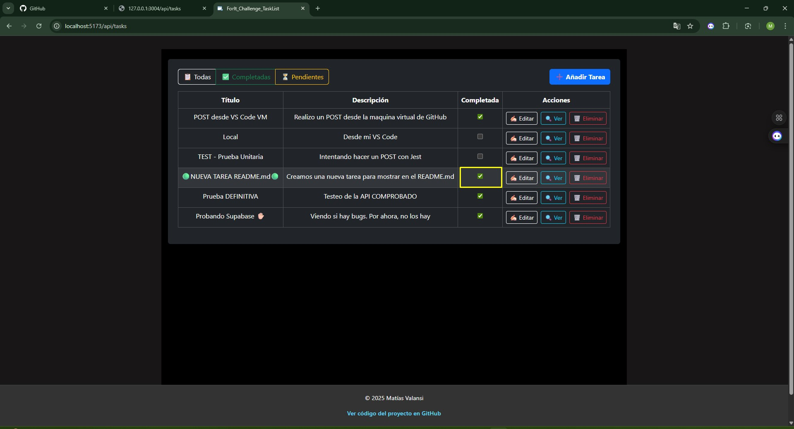
La marco como completada

## Componente TaskItem.jsx

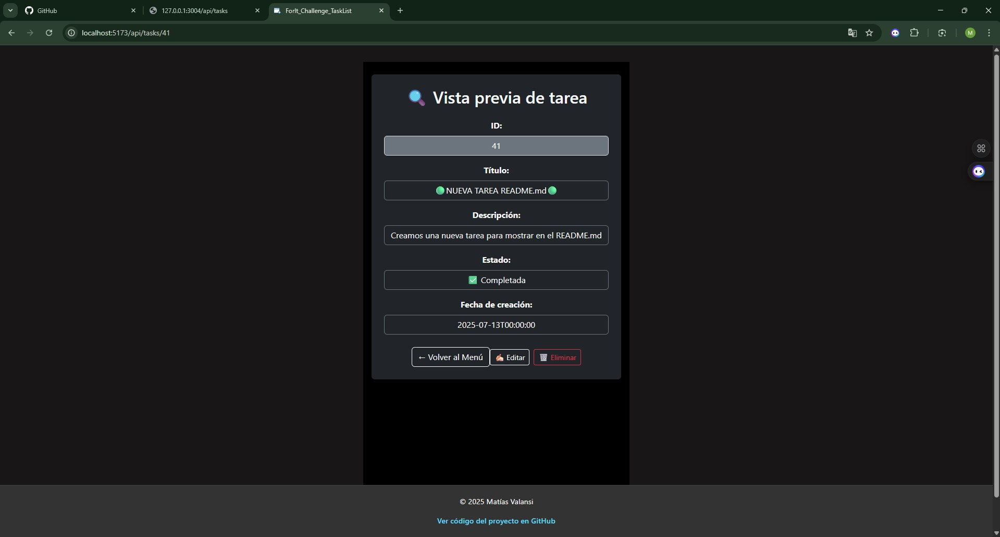
Muestra los detalles de la tarea en http://localhost:5173/api/tasks/id el id es 41, en este caso. Puedo EDITAR o ELIMINAR la tarea desde acá, pero volveré a la lista de tareas y haré estas 2 acciones desde allí.

## Edito nuestra tarea

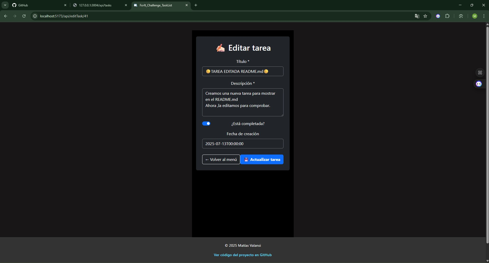
Nos redirige al componente TaskForm.jsx pero con los datos de la tarea a actualizar precargados.

## Muestro la tarea con los datos actualizados

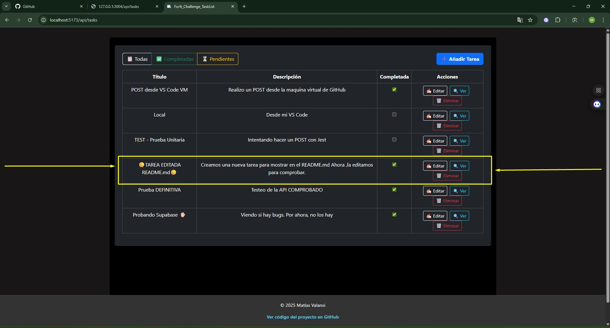

## La tarea fue eliminada

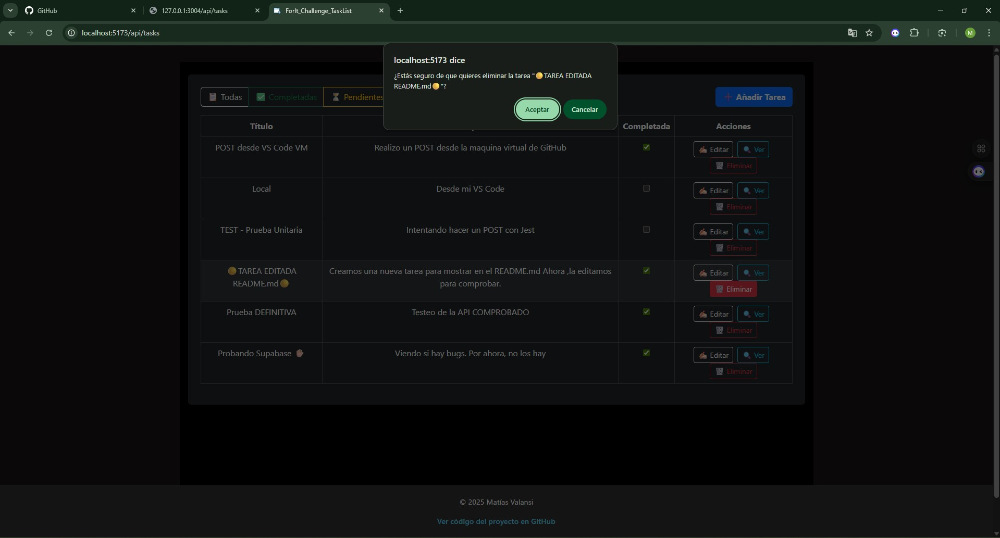

## Muestro como fue eliminada y como quedó la lista de tareas

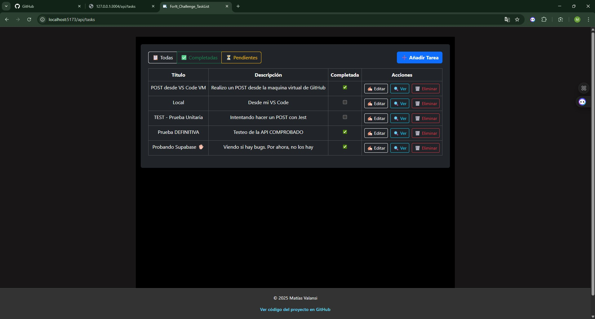

## Puedo filtrar las tareas completadas

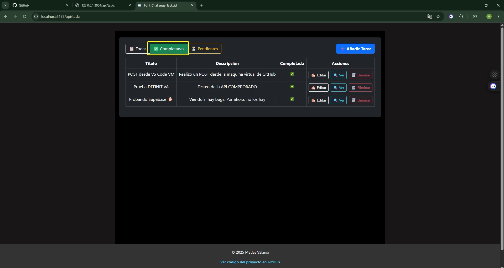

## También, las tareas pendientes

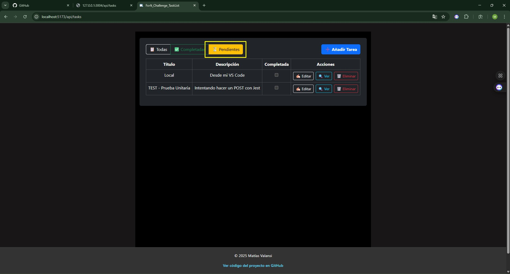

## Por ultimo, todas las tareas

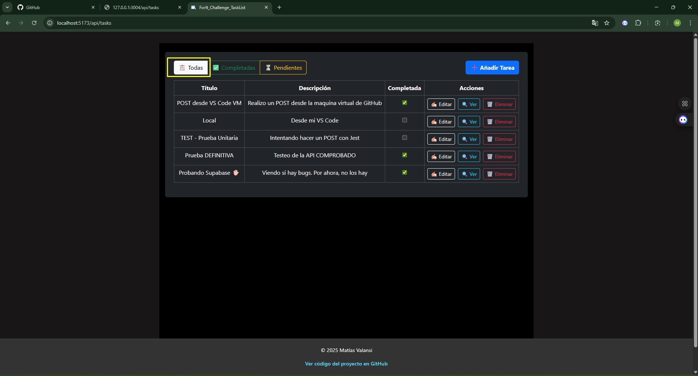

## API

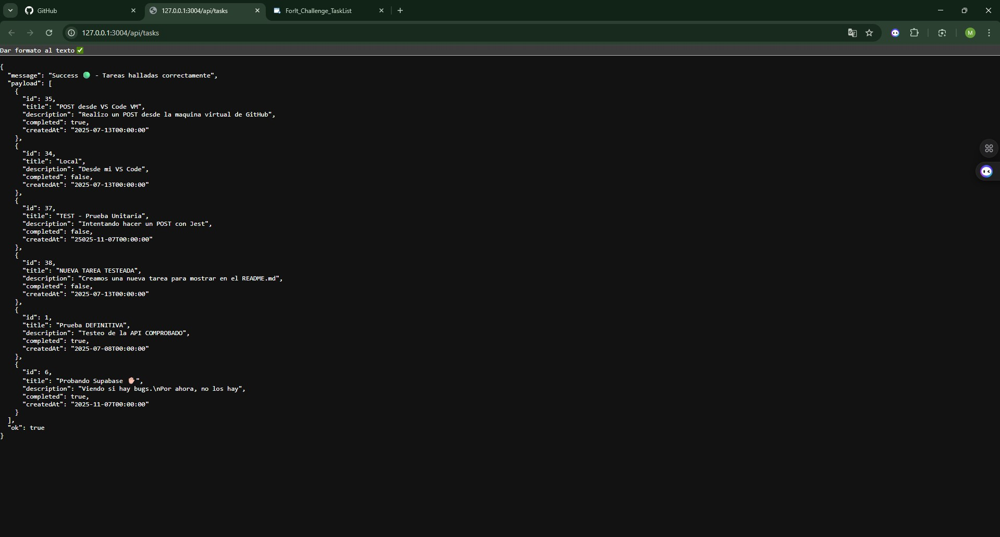

## Base de Datos en Supabase

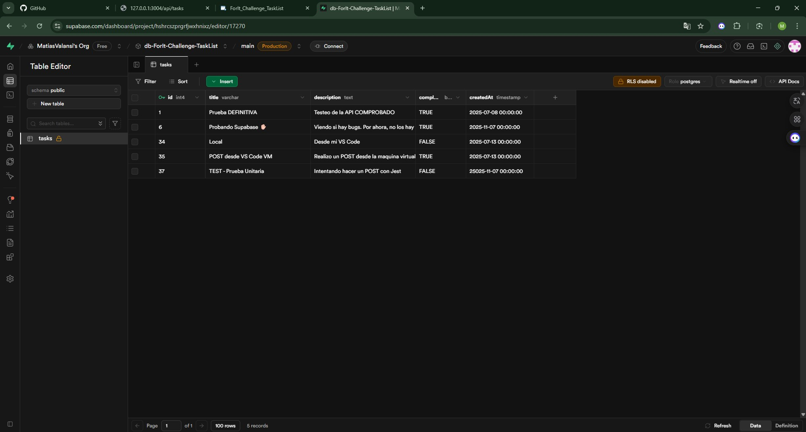

---
# Información acerca del Proyecto y las herramientas utilizadas

## ⚙️ Herramientas utilizadas

### BackEnd
- **Node.js** + **Express** Requisito obligatorio
- **Supabase** como base de datos
- **ESLint** configuración recomendada en la consigna
- **Jest** + **Supertest** para pruebas unitarias, solo realicé 2. Una del POST y ptra del DELETE.
- **Biome** como formateador de código
- **Dotenv** para variables de entorno
- **CORS** Con esto el navegador no bloqueará mi conexión entre el Back y el Front

### FrontEnd
- **React 19** Requisito obligatorio
- **React Router DOM 7** Requisito obligatorio
- **Bootstrap 5** para el diseño
- **ESLint** configuración recomendada en la consigna
- **Biome** como formateador de código
- **Vite** para el entorno de desarrollo

---

## 🧪 Requerimientos para ejecutar localmente

### ✅ Requisitos previos
- Tener instalado **Node.js** y **npm**

---

## 🔧 En caso de no correr en la la maquina virtual de GitHub, Clonar el proyecto

```bash
git clone https://github.com/MatiasValansi/ForIT-TaskList.git
cd ForIT-TaskList
```

---

## 📁 Variables de entorno

### 📦 BackEnd

Renombrá el .env.example en .env para poder correr el proyecto npm run app:

`env.example .env` 


### 🌐 FrontEnd

Renombrá el .env.example en .env para poder correr el proyecto npm run dev:

`env.example .env` 


---

## 🧪 Pruebas unitarias

En el backend podés correr pruebas unitarias con:

```bash
npm run test
```

Se utilizan Jest y Supertest para testear la API.

---

## 🧹 Linting y formato

### BackEnd

```bash
npm run lint
npm run biome
```

### FrontEnd

```bash
npm run lint
npm run format
```

---

## 👨‍💻 Comentarios finales

- Se respetaron todos los requisitos obligatorios del PDF.
- Se agregaron funcionalidades extra como diseño con Bootstrap, pruebas unitarias y conexión a Supabase.
- El proyecto es fácilmente extensible y está organizado en capas (`controller`, `service`, `repository`, etc.).
